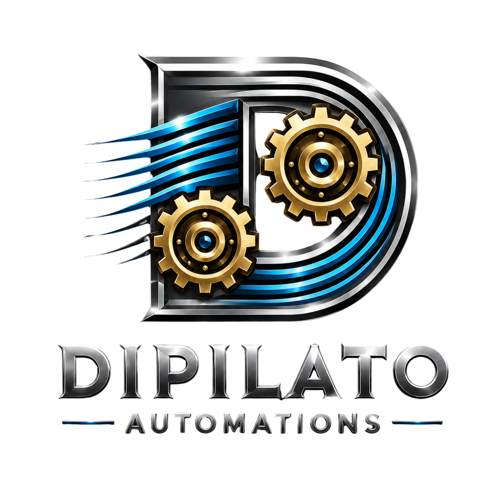

Done-for-you AI automation for contractors and local service businesses, built in **Worcester County, MA**. We build systems that answer the phone, rescue missed calls, book the job, and follow up — so the owner can stay on the roof.

No drag-and-drop platforms. Everything is code — TypeScript, Rust, and AI agents — owned by the business it serves.

---

## Products

| Product | What it does |
|---|---|
| **Job Rescue** | Missed-call text-back — a missed call gets an instant text before the customer dials your competitor |
| **BookingBot** | AI-powered booking automation — [source](https://github.com/JonDipilato/bookingbot-saas) |
| **Job Estimate AI** | Fast AI-drafted estimates for service jobs |
| **Atlas** | Private AI chief of staff on your own hardware — with [Business Builders](https://github.com/Auto-Atlas) |

## Services

- **AI receptionists** — answer, qualify, and route every call, 24/7
- **Missed-call text-back** — the fastest ROI in local service
- **Lead capture & follow-up** — forms, chat, and CRM that actually fire
- **Booking systems** — from "can you come look at it?" to a slot on the calendar
- **SEO / AEO / GEO** — get found in Google, Maps, and AI search
- **Custom builds** — if a human at your company does it twice, we automate it

## Watch it work

Real demos, recorded on real systems — no mockups.

| | | |
|:---:|:---:|:---:|
|  |  |  |
| **AI receptionist** answering while the owner works | **Atlas** delivering a morning brief on local AI | **Motion graphics** built with AI coding agents |

## How we build

1. **No placeholders, no mock data.** Invented proof is worse than no proof.
2. **No silent fallbacks.** When something breaks, it alerts loudly — it never limps along quietly until a customer finds it.
3. **Prove, don't claim.** A feature isn't done until it fired in a real run with logs to show.
4. **Owned, not rented.** Clients get systems built in code they control — not a subscription to someone else's drag-and-drop platform.

---

Founded by <a href="https://github.com/JonDipilato">Jon DiPilato</a> — <em>"If a human does it twice, I automate it."</em>

  

